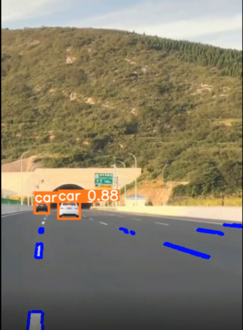

**基于YOLOv5与霍夫变换的车道线检测**

本项目采用yolov5做目标检测，采用传统图像处理霍夫变换做车道线检测。因此针对车道线部分不需要做数据集训练。

# 车道线检测参数说明：

```python
	# lane detection
    parser.add_argument('--lane', action='store_true', default=True, help='lane detection')
    parser.add_argument('--red_thres', type=int, default=120, help='R channel threshold')
    parser.add_argument('--green_thres', type=int, default=160, help='G channel threshold')
    parser.add_argument('--blue_thres', type=int, default=120, help='B channel threshold')
    parser.add_argument('--scale', type=float, default=0.6, help='mask scale')
```

--lane:是否开启车道线检测

--red_thres: R通道颜色阈值

--green_thres:G通道颜色阈值

--blue_thres:B通道颜色阈值

(上述三个通道颜色阈值主要用于颜色筛选，可以根据自己的画面进行调整)

--scale:用于设定mask缩放区域，**数字越小检测的区域越大**，但引入的噪声也会越多。

# 车道线检测：

输入命令：

```
python detect.py --weights yolov5s.pt --source data/images/test.mp4 --lane
```

<p align="center">
  
</p>

# 训练自己的数据集：

1.在工程下面中的datasets文件下放入自己的数据集。目录形式如下：

```
datasets
|-- Annotations
|-- ImageSets
|-- images
|-- labels
```

Annotations是存放**xml**标签文件的，images是存放**图像**的，ImageSets存放四个txt文件【后面运行代码的时候会自动生成】，labels是将xml转txt文件。

2.接下来运行：

```
python makeTXT.py
```

会在datasets/ImageSets下生成4个txt文件

3.在运行voc_label.py之前需要修改classes，写入自己的类即可。运行：

```python
python voc_label.py
```

voc_label会读取图像路径，在datasets/下生成三个txt文件【文件内是图像路径】，在lables/下会生成标签数据

4.在data下新建一个mydata.yaml【也可以修改coco.yaml内容】。yaml内容如下。

```
train: ./datasets/train.txt
val: ./datasets/val.txt
test: ./datasets/test.txt

# number of classes
nc: 1

# class names
names: ['target']
```

5.训练

```
python train.py --weights yolov5s.pt --cfg models/yolov5s.yaml --data data/mydata.yaml --batch-size 8 --device 0
```

如果是需要对yolov5进一步的轻量化，比如做通道剪枝，可以参考我其他代码链接：

CSDN:https://blog.csdn.net/z240626191s/article/details/127103705

code:https://github.com/YINYIPENG-EN/Pruning_for_YOLOV5_pytorch.git
